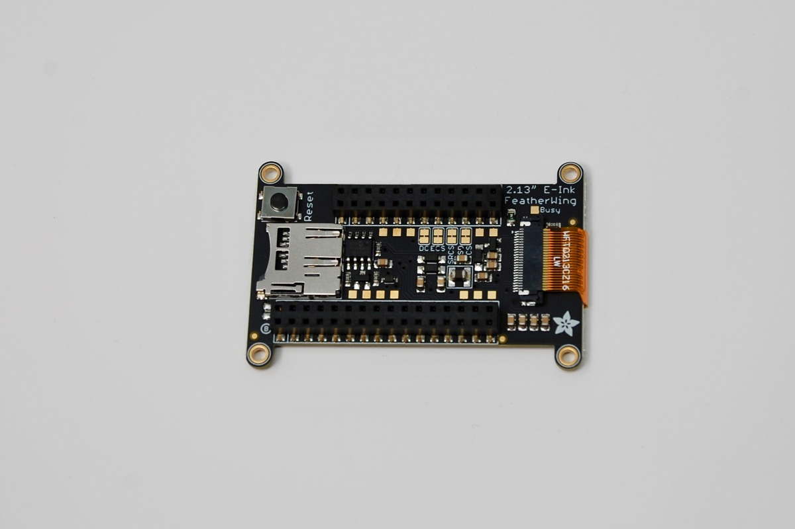
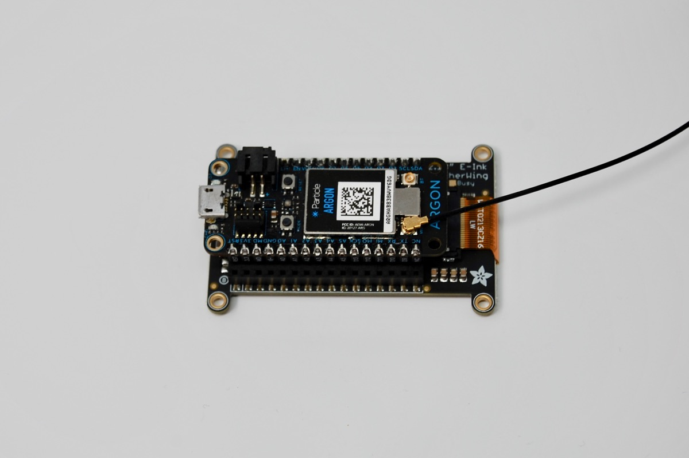

# Adafruit\_EPD\_RK

*Particle port of the Adafruit EPD (e-paper, e-ink) display library*

This library is used to support the [Adafruit 2.13" tri-color EPD display](https://www.adafruit.com/product/4128) (212x104 pixels). It can also be used with other Adafruit EPD displays.

You can find more about the displays on the [Adafruit page](https://learn.adafruit.com/adafruit-eink-display-breakouts/overview).

| Particle Pin | Display Pin | Description |
| :---: | :---: | --- |
| D2 | SDCS | SD card Chip Select, required for communicating with the onboard SD card holder |
| D3 | SRCS | SRAM Chip Select, required for communicating with the onboard RAM chip |
| D4 | ECS | E-Ink Chip Select, required for controlling the display |
| D5 | D/C | E-Ink Data/Command pin, required for controlling the display |
| MISO | MISO | SPI master in, slave out | 
| MOSI | MOSI | SPI master out, slave in |
| SCK | SCK | SPI clock |

- RST is connected to the hardware reset button, not a GPIO
- BUSY is on a pad, but by default not connected to anything

This library is a port of the [Adafruit_EPD](https://github.com/adafruit/Adafruit_EPD) library.

It also relies on:

- [Adafruit\_GFX\_RK](https://github.com/rickkas7/Adafruit_GFX_RK), a port of the [Adafruit-GFX](https://github.com/adafruit/Adafruit-GFX-Library) graphics library.
- [SdFat](https://github.com/greiman/SdFat-Particle), an implementation of the FAT file system on SD card for Particle.

The back of the board looks like this:

And with an Argon inserted:

## Example

In order to use the bitmap feature of the display, you'll need to have a FAT formatted micro SD card. Copy the blinka.bmp file to the top level of the SD card, then put it into the SD card slot on the FeatherWing.

You'll need to flash the examples/FeatherWingTest program to your Argon, Boron, or Xenon.

It will display several test patterns:

- Lines
- Text
- The Adafruit graphic (if you set up the SD card)

The display only updates every 3 minutes, as the Adafruit documentation warns that the display can be permanently damaged if you refresh it more often than that.

## Version History

#### 2.3.1 (2020-08-02)

- Updated Adafruit_GFX_RK to 1.5.8

#### 2.3.0 (2019-12-15)

- Updated to Adafruit version 2.3.0
